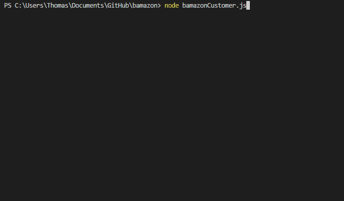
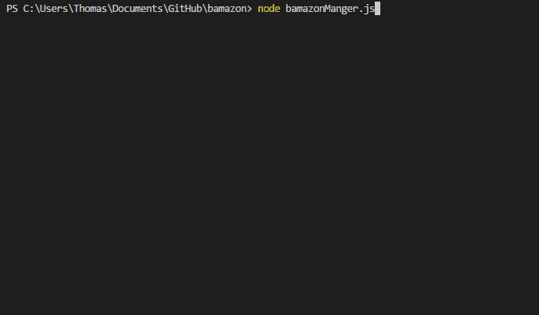

# Bamazon App

## Phase 1:

As a customer you get a list of 10 items for sale.
You select the item by its id and the quanity you want.

If there are enough items then your price is returned,
Otherwise you get a warning message that there are not enough items for the order.

Then you are asked if you would like to continue shopping, if not the connection ends.

The database is persistent because of MySQL.

## Phase 2:

This view is for the manager.

This allows the manager to see all of the inventory, see if any items are low, add to the quanitity of an item, and add a brand new item.